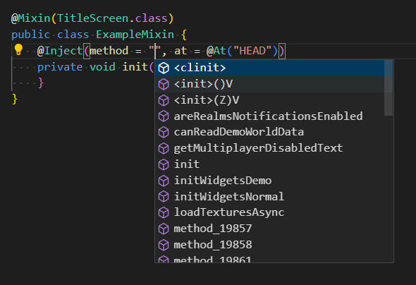

# IDE Java Extensions

Various IDE extensions for Java language (and Spongepowered Mixin/Minecraft) support.

Supported IDEs:

- [Visual Studio Code](https://code.visualstudio.com)

In development:

- [NeoVim](https://neovim.io)
- [Zed](https://zed.dev)

## Extensions

- Spongepowered Mixin Support
  - Provides support for [Spongepowered Mixin](https://github.com/SpongePowered/Mixin)
  - Useful for e.g. modding [Minecraft](https://www.minecraft.net)

## Showcase

## Download

TODO: Upload the extensions to the [Visual Studio Code Marketplace](https://marketplace.visualstudio.com) and the [Open VSX Registry](https://open-vsx.org)

## Contributing

If you've encountered a problem or you want to suggest
features, [create an issue](https://github.com/steves-underwater-paradise/ide-java-extensions/issues/new) on the issue tracker.

### Development

- `git clone https://github.com/steves-underwater-paradise/ide-java-extensions.git`
- `cd ide-java-extensions`
- `./gradlew build`

## Attribution

- Thank you to [Enbrain](https://github.com/enbrain) for creating the Spongepowered Mixin Support extension for Visual Studio Code, which this project forks from

## License

This project is licensed under EPL-2.0, see [LICENSE](LICENSE).
